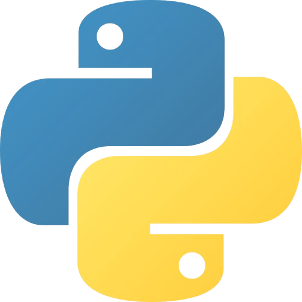
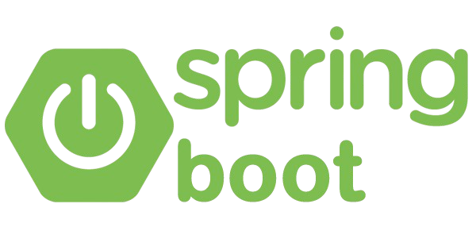

#  Hi there! I'm Ian Mondelaers

```
       ....                                         ....        .      .
   .xH888888Hx.                                  .x88" `^x~  xH(`     @88>
 .H8888888888888:                  u.    u.     X888   x8 ` 8888h     %8P                  u.    u.
 888*"""?""*88888X        .u     x@88k u@88c.  88888  888.  %8888      .          u      x@88k u@88c.
'f     d8x.   ^%88k    ud8888.  ^"8888""8888" <8888X X8888   X8?     .@88u     us888u.  ^"8888""8888"
'>    <88888X   '?8  :888'8888.   8888  888R  X8888> 488888>"8888x  ''888E` .@88 "8888"   8888  888R
 `:..:`888888>    8> d888 '88%"   8888  888R  X8888>  888888 '8888L   888E  9888  9888    8888  888R
        `"*88     X  8888.+"      8888  888R  ?8888X   ?8888>'8888X   888E  9888  9888    8888  888R
   .xHHhx.."      !  8888L        8888  888R   8888X h  8888 '8888~   888E  9888  9888    8888  888R
  X88888888hx. ..!   '8888c. .+  "*88*" 8888"   ?888  -:8*"  <888"    888&  9888  9888   "*88*" 8888"
 !   "*888888888"     "88888%      ""   'Y"      `*88.      :88%      R888" "888*""888"    ""   'Y"
        ^"***"`         "YP'                        ^"~====""`         ""    ^Y"   ^Y'
```

---

- 👯 I’m looking to collaborate
- 📫 How to reach me:
  - [email](mondelaers.ian@gmail.com)
  - Discord: DenGian
- 🖇 Connect with me:  
  <a href="https://www.linkedin.com/in/ian-mondelaers-980b8622a/">
  
  </a>

---

### 🧑🏼‍💻 The languages I use

|             HTML             |            CSS            |           JavaScript           |           PHP            |           TypeScript           |             C#             |           SQL            |            Java            |             Python             |
| :--------------------------: | :-----------------------: | :----------------------------: | :----------------------: | :----------------------------: | :------------------------: | :----------------------: | :------------------------: | :----------------------------: |
|  |  |  |  |  |  |  |  |  |

### ⚒️ The tools I use 🛠

|               SASS               |               ReactJS                |                Angular                 |                    ExpressJS                    |                Symfony                 |                 Git                 |               .NET               |                Node.js                |                Spring                |                  React Native                   |                Webots                |
| :------------------------------: | :----------------------------------: | :------------------------------------: | :---------------------------------------------: | :------------------------------------: | :---------------------------------: | :------------------------------: | :-----------------------------------: | :----------------------------------: | :---------------------------------------------: | :----------------------------------: |
|  |  |  |  |  |  |  |  |  |  |  |

---

### 👀 Currently looking to:

- 📚 Improve my knowledge
- 🧠 Improve my programming skills

---

<blockquote cite="https://twitter.com/housecor/status/400479246713229312">
“Code is like humor. When you have to explain it, it’s bad.“
 – Cory House
</blockquote>
