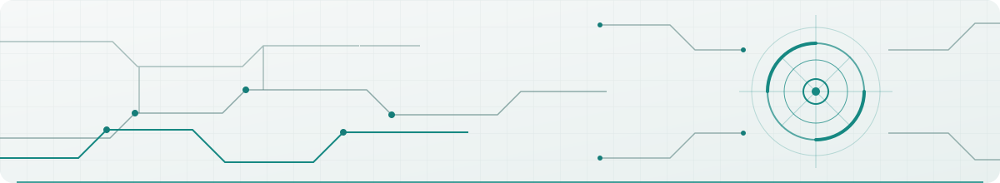

<picture>
  <source media="(prefers-color-scheme: dark)" srcset="assets/profile-header-dark.svg">
  <source media="(prefers-color-scheme: light)" srcset="assets/profile-header-light.svg">
  
</picture>

# Ian Mondelaers

**Software Engineer · Applied Computer Science**

I'm a software engineer who likes understanding what sits underneath a system, not just getting it to work. I tend to question where complexity comes from, how boundaries are drawn, and what will still make sense when a project grows beyond its first version.

My work moves between backend and full-stack systems, browser engineering and robotics. I'm completing a Bachelor's in Applied Computer Science at AP Hogeschool Antwerpen with a Robotics minor.

 

## Currently

I'm currently exploring agentic software systems, AI orchestration, software architecture and autonomous systems, particularly where reliable software has to reason, use tools and interact with the physical world.

*I’m less interested in making software look clever than in making complex systems understandable, reliable, and worth building.*
